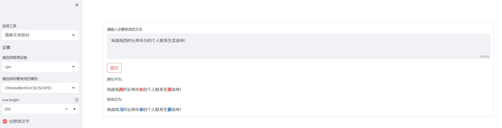
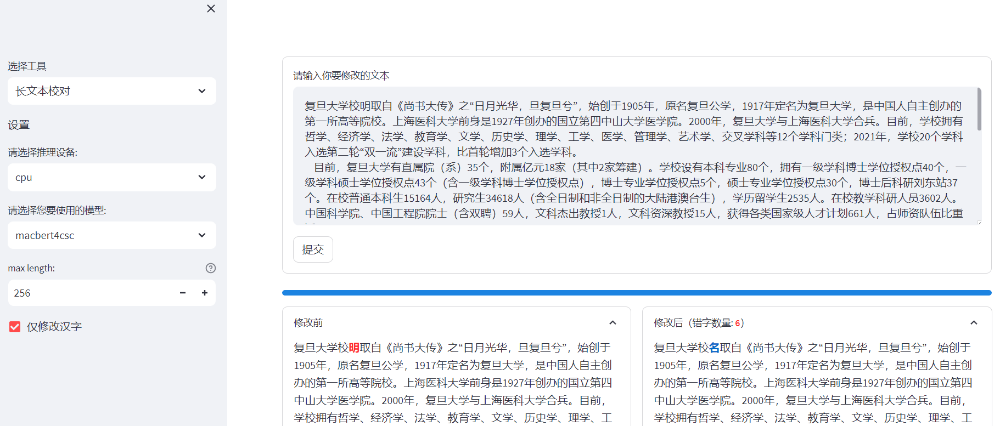
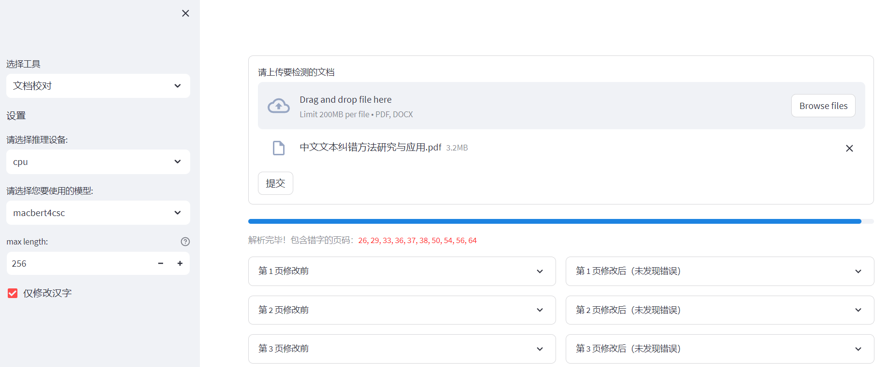

# csc_tools

csc_tools是一个中文拼写纠错（Chinese Spell Checking / Chinese Spell Correction, CSC）工具箱，帮助人们利用已有模型方便的进行中文拼写纠错。

> 中文拼写纠错仅针对错字进行修改，不处理多字和漏字的情况。

# 页面展示

目前，该工具支持如下功能：

- 简单文本校对：对不超过500字的中文文本进行纠错。
- 长文本校对：对不限文本长度的中文文本进行纠错。
- 文档校对：对文档进行校对。支持PDF和DOCX，其中PDF按页进行划分，DOCX按章节进行划分（以文章中的二级标题为一个单位）。

效果图如下：








# 项目部署


1. 安装依赖：
```
pip install -r requirments.txt
```

2. 运行`streamlit_demo.py`
```
streamlit run streamlit_demo.py
```

